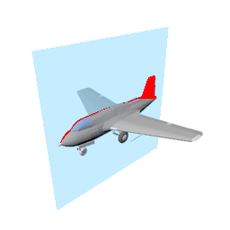
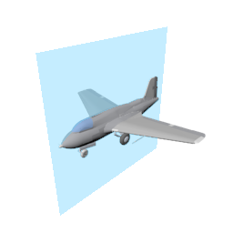
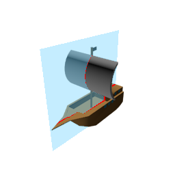
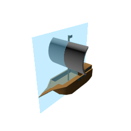

# NeRD: Neural 3D Reflection Symmetry Detector

This repository contains the official PyTorch implementation of the paper:  *[Yichao Zhou](https://yichaozhou.com), [Shichen Liu](https://shichenliu.github.io/), [Yi Ma](https://people.eecs.berkeley.edu/~yima/). "[NeRD: Neural 3D Reflection Symmetry Detector](https://arxiv.org/abs/2105.03211)"*. CVPR 2021.


## Introduction

We present NeRD, a **Ne**ural 3D **R**eflection Symmetry **D**etector, which combines the strength of learning-based recognition and geometry-based reconstruction to accurately recover the normal direction of objects' mirror planes. NeRD uses coarse-to-fine strategy to enumerate the symmetry planes and then find the best ones by building 3D cost volumes to examine the intra-image pixel correspondence from the symmetry.

## Qualitative Measures

|  |  |  |  |
| :----: | :--: | :----: | :--: |
| ResNet Regression | **NeRD** |          ResNet Regression           | **NeRD** |

Errors of the mirror plane are marked in red.

## Code Structure

Below is a quick overview of the function of key files.

```bash
########################### Data ###########################
data/
    shapenet-r2n2/              # default folder for the shapenet dataset
    new_pix3d/                  # default folder for the pix3d dataset
logs/                           # default folder for storing the output during training
########################### Code ###########################
config/                         # neural network hyper-parameters and configurations
    shapenet.yaml               # example config for shapenet
    pix3d.yaml                  # example config for pix3d
misc/                           # misc scripts that are not important
    find-radius.py              # script for generating figure grids
sym/                            # sym module so you can "import sym" in other scripts
    models/                     # neural network architectures
        symmetry_net.py         # wrapper for loss
        mvsnet.py               # 3D hourglass
    config.py                   # global variables for configuration
    datasets.py                 # reading the training data
    trainer.py                  # general trainer
train.py                        # script for training the neural network
eval.py                         # script for evaluating a dataset from a checkpoint
plot-angle.py                   # script for ploting angle error curves
plot-depth.py                   # script for ploting depth error curves
```

## Reproducing NeRD

### Installation

For the ease of reproducibility, you are suggested to install [miniconda](https://docs.conda.io/en/latest/miniconda.html) before following executing the following commands.

```bash
git clone https://github.com/zhou13/nerd
cd nerd
conda create -y -n nerd
source activate nerd
conda install -y pyyaml docopt matplotlib scikit-image opencv tqdm
# Replace cudatoolkit=10.2 with your CUDA version: https://pytorch.org/get-started/
conda install -y pytorch cudatoolkit=10.2 -c pytorch
mkdir data logs results
```

### Downloading the Processed Datasets
Make sure `curl` is installed on your system and execute
```bash
cd data
../misc/gdrive-download.sh 1zdHsSb-xHhY8imIy3uWt_XfBW_YQX4Vh shapenet-r2n2.zip
../misc/gdrive-download.sh 1tzR5WDrbYTFkVu58p8qad6CXw6Bw2yNt new_pix3d.zip
unzip *.zip
rm *.zip
cd ..
```

If `gdrive-download.sh` does not work for you, you can download the pre-processed datasets
manually for [ShapeNet](https://drive.google.com/file/d/1zdHsSb-xHhY8imIy3uWt_XfBW_YQX4Vh) and [Pix3D](https://drive.google.com/file/d/1tzR5WDrbYTFkVu58p8qad6CXw6Bw2yNt), and proceed accordingly.

### Training (Optional)
Execute the following commands to train the neural networks from scratch with four GPUs (specified by `-d 0,1,2,3`):
```bash
python ./train.py -d 0,1,2,3 --identifier baseline config/shapenet.yaml
python ./train.py -d 0,1,2,3 --identifier baseline config/pix3d.yaml
```

The checkpoints and logs will be written to `logs/` accordingly.

### Pre-Trained Models
```bash
cd logs/
../misc/gdrive-download.sh 1VVd11U_8wPtrLKjufvcdbJ59h0AJQwCW 200610-234002-8ee0ad2-shapenet-latest.zip  # ShapeNet/Symmetry
../misc/gdrive-download.sh 1HcDCWRbafN4GKC4DzeG17Fo7iXimYI0v 200513-030330-c8e671c-shapenet-finetune.zip  # ShapeNet/Depth
../misc/gdrive-download.sh 1Nug2c3u1THbPNmTaiGlR8R508nDHP43Q 201113-224159-ec0e932-pix3d-001008000.zip  # Pix3d/Symmetry
unzip *.zip
rm *.zip
cd ..
```
Alternatively, you can download our reference pre-trained models for [ShapeNet (Symmetry)](https://drive.google.com/file/d/1VVd11U_8wPtrLKjufvcdbJ59h0AJQwCW), [ShapeNet (Depth)](https://drive.google.com/file/d/1HcDCWRbafN4GKC4DzeG17Fo7iXimYI0v), and [Pix3D](https://drive.google.com/file/d/1Nug2c3u1THbPNmTaiGlR8R508nDHP43Q).

### Evaluation

To evaluate the models with coarse-to-fine inference for symmetry plane prediction and depth map estimation, execute

``` bash
python eval.py -d 0 --output results/nerd.npz logs/<your-checkpoint>/config.yaml logs/<your-checkpoint>/checkpoint_latest.pth.tar
```

The error statistics are printed on the screen and the error metrics are stored in `results/nerd.npz`. To calculate the error metrics and plot the error-percentage curves, execute

``` bash
python plot-angle.py
python plot-depth.py
```


## Acknowledgement

This work is supported by the research grant from Sony, the ONR grant N00014-20-1-2002, and the joint Simons Foundation-NSF DMS grant 2031899.  We also thank Li Yi from Google Research for his comments.

## Citing NeRD

If you find NeRD useful in your research, please consider citing:

```bib
@inproceedings{zhou2021nerd,
    author = {Zhou, Yichao and Liu, Shichen and Ma, Yi},
    title = {{NeRD}: Neural 3D Reflection Symmetry Detector},
    year = {2021},
    booktitle = {CVPR},
}
```
